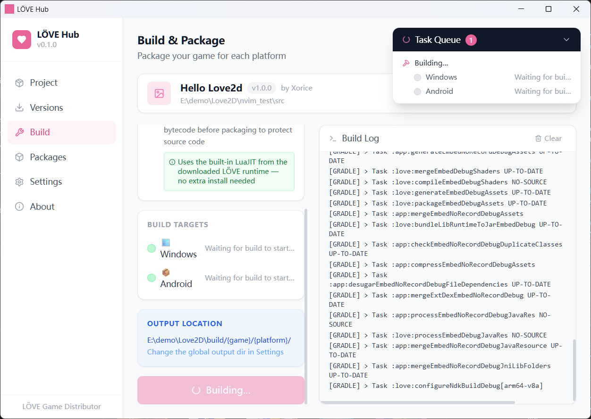

# LÖVE Hub

**A GUI tool for packaging and distributing [LÖVE](https://love2d.org) games.**  
Download LÖVE runtimes, configure your project, and build standalone executables for Windows, Linux, and Android — all from one place.

> The GUI was built with AI assistance (vibe coding).

[中文文档](README.zh-CN.md)

---



---

## Usage

### 1. Download a LÖVE runtime

Go to **Version Manager → Get New Version**, click **Refresh** to load the version list from GitHub, then click **Download** next to the platform you need.

> To use LÖVE v12 (pre-release), make sure **Show pre-releases** is checked.

### 2. Configure your project

Go to **Project Config** and fill in:
- Game name and version (required)
- Source directory — the folder containing `main.lua`
- Target platforms (Windows, Linux, Android)

### 3. Build

Go to **Build & Package**, select the LÖVE version, then click **Start Build**.  
Output files are placed in `{output dir}/{game name}/{platform}/`.

---

## Download

Pre-built releases for Windows are available on the [Releases](https://github.com/Xorice/love2dhub/releases) page.

---

## Build from Source

**Requirements**

| Tool | Version |
|------|---------|
| Rust | 1.75+ |
| Node.js | 18+ |
| npm / pnpm | any |
| Visual Studio Build Tools *(Windows only)* | 2019 or 2022, "Desktop development with C++" workload |

```bash
# Clone
git clone https://github.com/Xorice/love2dhub.git
cd love2dhub

# Install frontend dependencies
npm install

# Generate app icons (required before first build)
node scripts/gen-icons.mjs

# Dev mode
npm run tauri dev

# Release build  →  src-tauri/target/release/bundle/
npm run tauri build
```

---

## Android Builds

Android packaging requires additional setup:

1. Download the **Android** runtime in Version Manager (this is the love-android template)
2. In **Settings → Android Build Environment**, set:
   - **Android SDK directory** (the folder containing `build-tools/`, `ndk/`, etc.)
   - **JDK 17 directory** (must be exactly JDK 17)
3. NDK version **26.1.10909125** must be installed via Android Studio's SDK Manager

> First build downloads several hundred MB of Gradle dependencies — this is normal.

For release APKs (Google Play), configure a keystore in **Settings → Android Release Signing**.

---

## Project Structure

```
love2dhub/
├── src/                    # React frontend
│   ├── components/         # UI panels
│   ├── store/              # Zustand global state
│   ├── lib/tauri.ts        # Tauri command bindings
│   └── i18n/               # zh-CN / en translations
├── src-tauri/              # Rust backend
│   └── src/commands.rs     # Build, download, and runtime commands
├── scripts/
│   └── gen-icons.mjs       # Icon generator (no dependencies)
└── docs/                   # Screenshots and assets
```

---

## Tech Stack

- [Tauri 2.0](https://tauri.app) — native shell
- [React 18](https://react.dev) + [TypeScript](https://www.typescriptlang.org) — frontend
- [Rust](https://www.rust-lang.org) — backend logic
- [Tailwind CSS](https://tailwindcss.com) — styling
- [Zustand](https://github.com/pmndrs/zustand) — state management
- [i18next](https://www.i18next.com) — internationalization

---

## License

MIT
