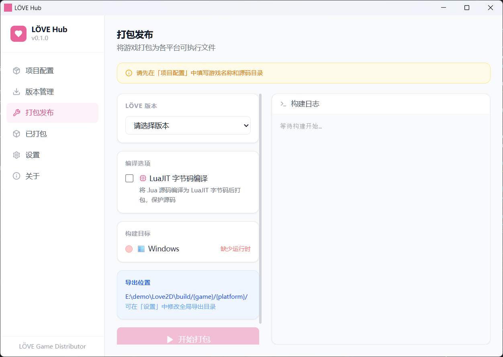

# LÖVE Hub

**[LÖVE](https://love2d.org) 游戏打包发布 GUI 工具。**  
下载 LÖVE 运行时，配置项目，一键将游戏打包为 Windows、Linux、Android 独立可执行文件。

[English](README.md)

---



---

## 使用方法

### 第一步：下载 LÖVE 运行时

进入**版本管理 → 获取新版本**，点击**刷新**从 GitHub 加载版本列表，然后点击对应平台的**下载**按钮。

> 如需使用 LÖVE v12（预发布版），请勾选**显示预发布版本**。

### 第二步：配置项目

进入**项目配置**，填写：
- 游戏名称和版本（必填）
- 游戏源码目录（需包含 `main.lua`）
- 目标平台（Windows、Linux、Android）

### 第三步：打包发布

进入**打包发布**，选择 LÖVE 版本，点击**开始打包**。  
输出文件位于 `{导出目录}/{游戏名}/{平台}/`。

---

## 下载

Windows 预编译版本见 [Releases](https://github.com/Xorice/love2dhub/releases) 页面。

---

## 从源码构建

**环境要求**

| 工具 | 版本 |
|------|------|
| Rust | 1.75+ |
| Node.js | 18+ |
| npm / pnpm | 任意 |
| Visual Studio Build Tools *（仅 Windows）* | 2019 或 2022，需勾选「使用 C++ 的桌面开发」工作负载 |

```bash
# 克隆仓库
git clone https://github.com/Xorice/love2dhub.git
cd love2dhub

# 安装前端依赖
npm install

# 生成应用图标（首次构建前必须执行一次）
node scripts/gen-icons.mjs

# 开发模式
npm run tauri dev

# 发行版构建  →  src-tauri/target/release/bundle/
npm run tauri build
```

---

## Android 构建

Android 打包需要额外配置：

1. 在版本管理中下载 **Android** 运行时（即 love-android 模板）
2. 在**设置 → Android 构建环境**中填写：
   - **Android SDK 目录**（包含 `build-tools/`、`ndk/` 等子目录的根目录）
   - **JDK 17 目录**（必须为精确的 JDK 17）
3. 通过 Android Studio 的 SDK Manager 安装 NDK 版本 **26.1.10909125**

> 首次构建时 Gradle 会下载数百 MB 的依赖，属正常现象。

如需打包 Release APK（用于 Google Play 发布），在**设置 → Android Release 签名**中配置 Keystore。

---

## 项目结构

```
love2dhub/
├── src/                    # React 前端
│   ├── components/         # UI 面板
│   ├── store/              # Zustand 全局状态
│   ├── lib/tauri.ts        # Tauri 命令封装
│   └── i18n/               # 中文 / 英文翻译
├── src-tauri/              # Rust 后端
│   └── src/commands.rs     # 构建、下载、运行时命令
├── scripts/
│   └── gen-icons.mjs       # 图标生成脚本（无外部依赖）
└── docs/                   # 截图与资源文件
```

---

## 技术栈

- [Tauri 2.0](https://tauri.app) — 原生框架
- [React 18](https://react.dev) + [TypeScript](https://www.typescriptlang.org) — 前端界面
- [Rust](https://www.rust-lang.org) — 后端逻辑
- [Tailwind CSS](https://tailwindcss.com) — 样式
- [Zustand](https://github.com/pmndrs/zustand) — 状态管理
- [i18next](https://www.i18next.com) — 国际化

---

## License

MIT
